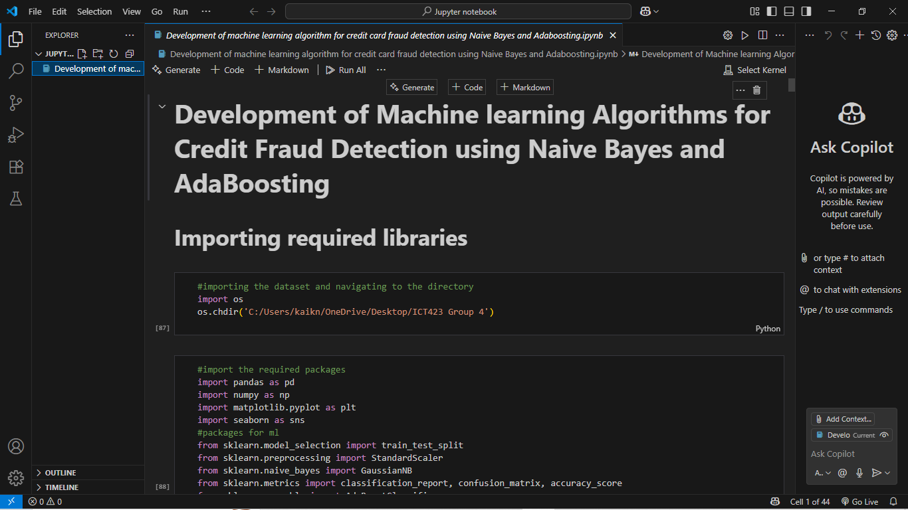
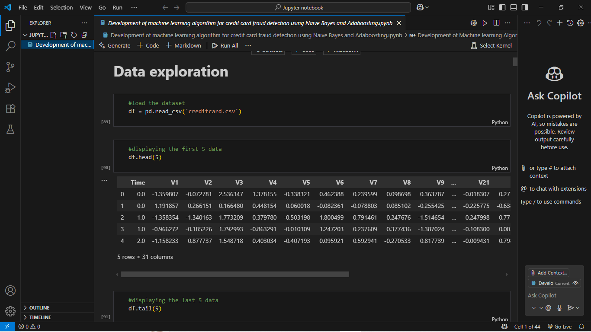
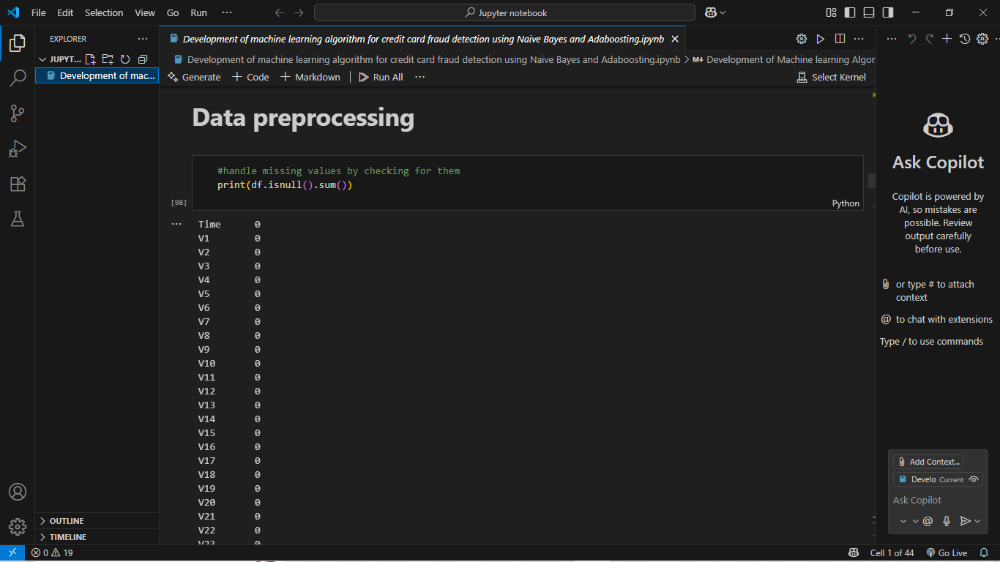
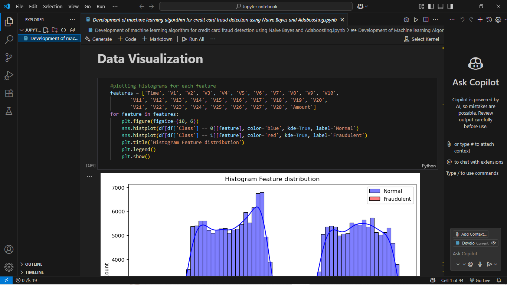
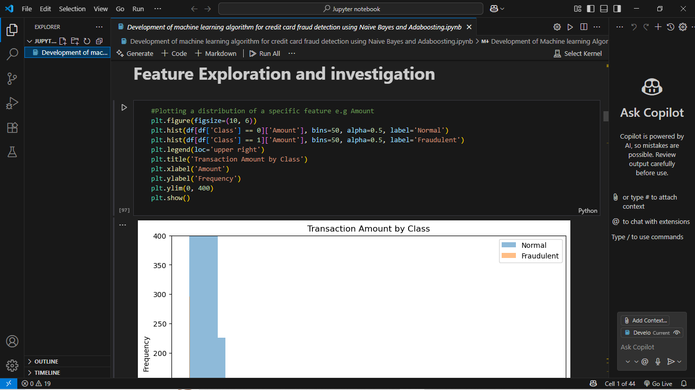
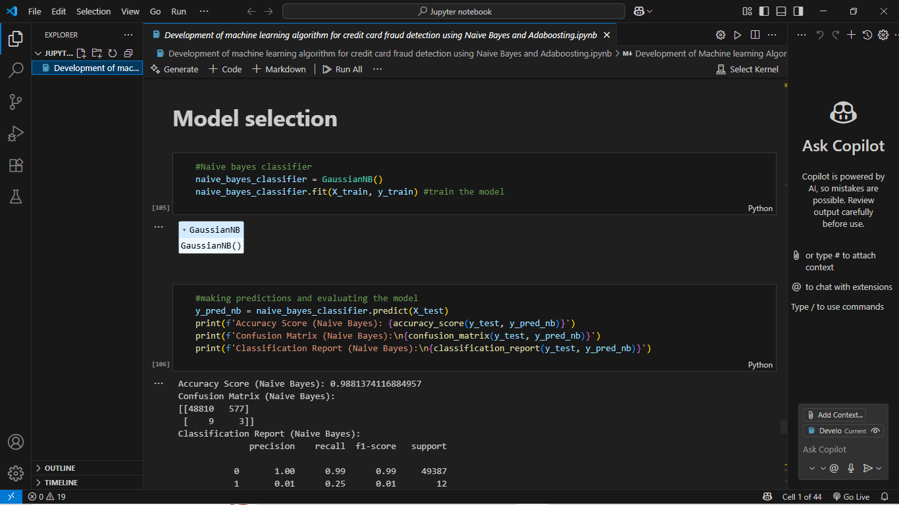
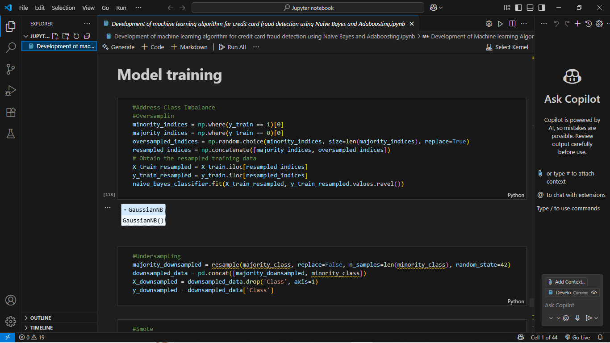
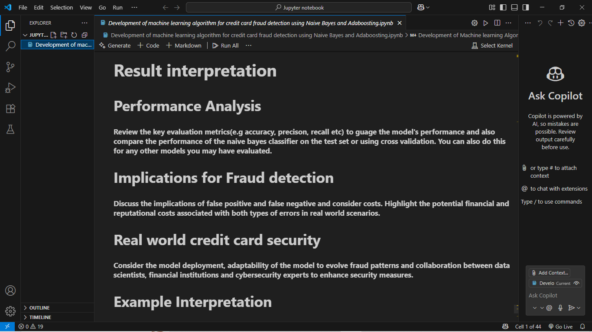
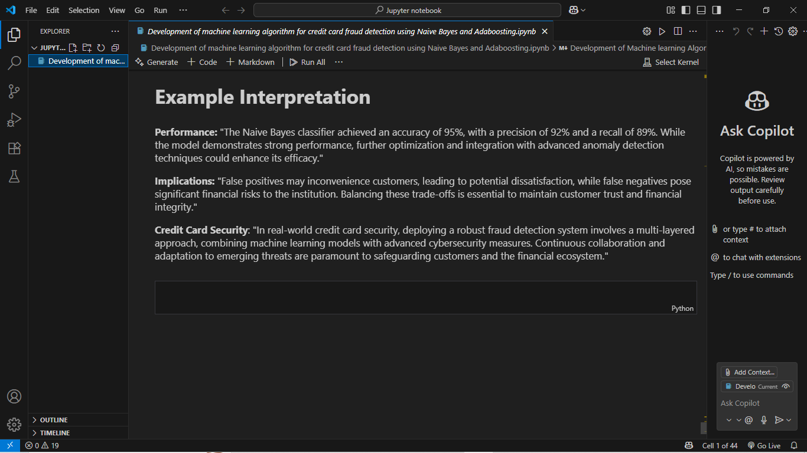

# Credit Card Fraud Detection
Development of a machine learning algorithm to prevent credit card fraud

Screenshots
  
Development of a machine learning algorithm to prevent credit card fraud

  
Data Exploration

  
Data Preprocessing

  
Data Visualization

  
Data Visualization

  
Feature Extraction

  
Model Selection

  
Model Training

  
Results

  
Results
